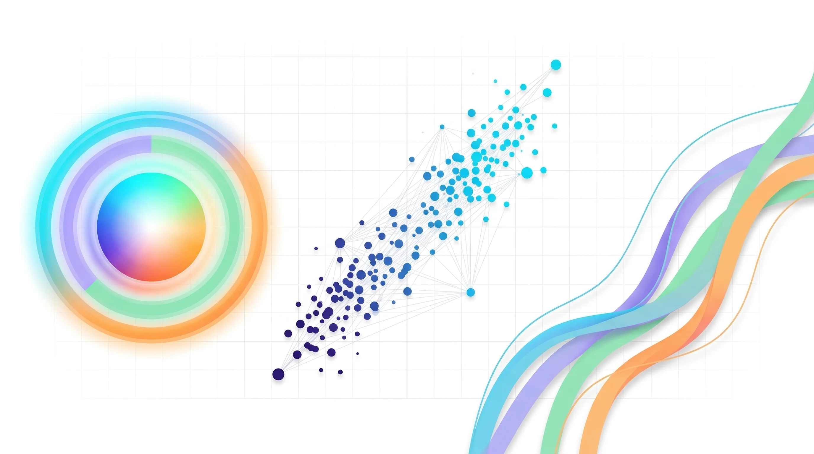
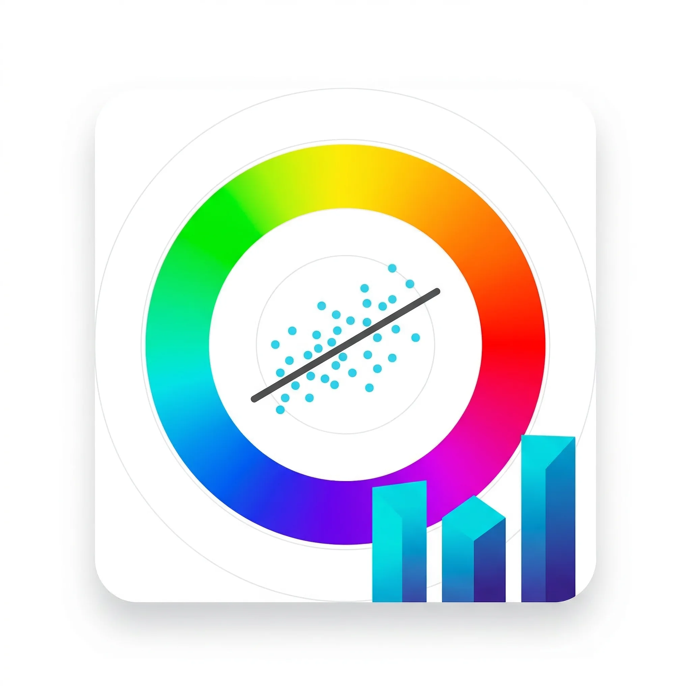
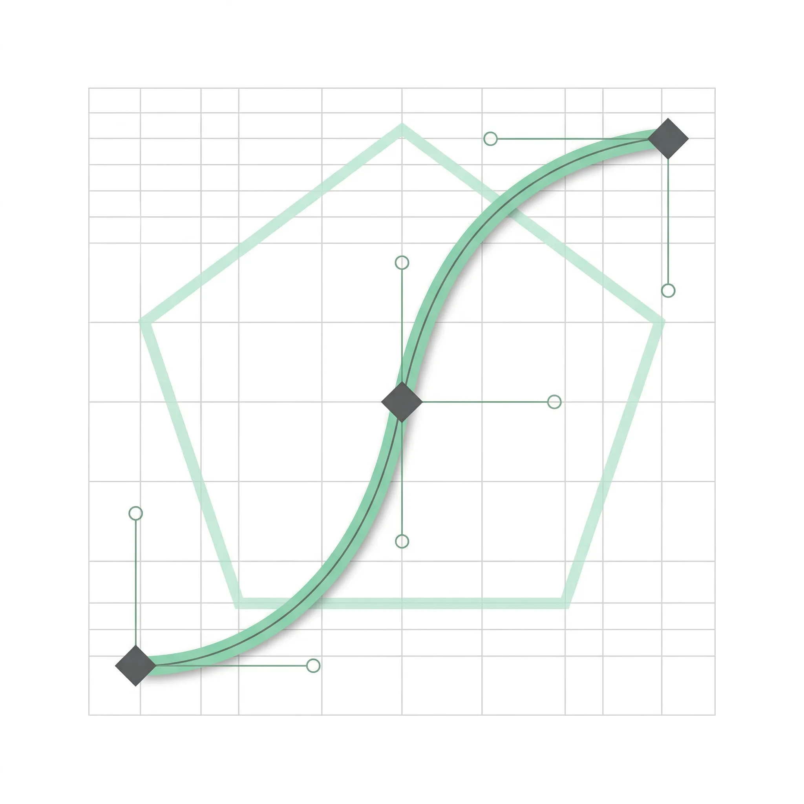

<div align="center">



# SciAesthetic · 科研美学

**你的研究值得更好的表达。**

[](https://cingyq.github.io/sci-aesthetic/)
[](LICENSE)


</div>

---

## 关于

SciAesthetic 是面向科研工作者的**交互式视觉传达知识百科**，覆盖从数据可视化到学术演示设计的完整体系。

不是线性课程，而是自由探索的词条网络——你可以从任意模块进入，按需浏览。每个页面都是一个独立的知识单元，配有交互工具和真实案例。

---

## 功能模块

<table>
<tr>
<td width="25%" align="center" valign="top">
<br><br>
<b>科研数据可视化</b><br>
<sub>色彩理论 · R/Python 图表 · 出版规格导出</sub>
</td>
<td width="25%" align="center" valign="top">
<br><br>
<b>AI 辅助科研绘图</b><br>
<sub>Prompt 技巧 · 矢量化 · 伦理边界</sub>
</td>
<td width="25%" align="center" valign="top">
<br><br>
<b>矢量绘图与设计</b><br>
<sub>Illustrator · 贝塞尔 · SVG 编辑</sub>
</td>
<td width="25%" align="center" valign="top">
<br><br>
<b>学术演示设计</b><br>
<sub>PPT · 海报 · 图摘 · 信息图</sub>
</td>
</tr>
</table>

---

## 技术栈

| 用途 | 技术 |
|------|------|
| 构建 | Vite + Vanilla JS（ES Modules） |
| 样式 | 原生 CSS（CSS Variables） |
| 滚动动画 | GSAP + ScrollTrigger |
| 数据可视化 | D3.js |
| 代码编辑器 | CodeMirror 6 |
| 部署 | GitHub Pages（GitHub Actions 自动构建） |

---

## 本地开发

```bash
git clone https://github.com/CingyQ/sci-aesthetic.git
cd sci-aesthetic
npm install
npm run dev
```

访问 `http://localhost:5173/sci-aesthetic/`

---

## 部署

推送到 `master` 分支后，GitHub Actions 自动构建并部署到 GitHub Pages。

手动触发：GitHub → Actions → Deploy to GitHub Pages → Run workflow

---

## License

MIT © 2025 SciAesthetic
